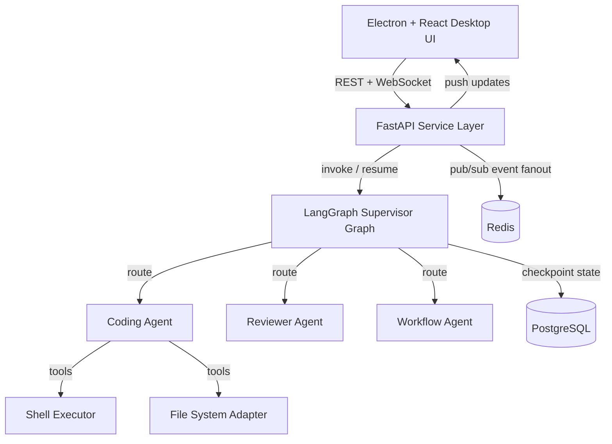

# Olympus Enterprise

## Implementation Specification

### Document Control

- Version: 1.0
- Status: Approved for implementation
- Audience: Engineering, Product, Security, Operations, Leadership
- Scope: Desktop-based enterprise control plane for AI agent orchestration and oversight

---

## 1. Executive Summary

Olympus Enterprise is a desktop application that enables organizations to run, monitor, and govern autonomous AI workflows with human oversight. The platform combines orchestration, live execution telemetry, intervention workflows, and auditability in a unified operational interface.

This specification defines the target implementation for production readiness, including architecture, service boundaries, security controls, user experience standards, delivery phases, and acceptance criteria.

---

## 2. Product Vision and Outcome Targets

### 2.1 Product Vision

Deliver a reliable, enterprise-grade operations console for agentic systems where teams can:

- launch and supervise AI tasks at scale;
- intervene when confidence or policy thresholds are not met;
- maintain full traceability for compliance and incident response.

### 2.2 Outcome Targets

- Improve task completion reliability with supervised orchestration.
- Reduce mean time to detect and remediate task failures.
- Establish auditable decision trails for every autonomous action.
- Provide leadership with real-time operational KPIs.

---

## 3. Experience and UI Standards

The interface must follow a clean enterprise dashboard model consistent with the provided reference (left navigation rail, KPI summary cards, central activity table, and explicit status badges).

### 3.1 Core Navigation

- Dashboard
- Task Kanban
- Agent Inspector
- Intervention Panel
- MCP Integrations

### 3.2 Dashboard Requirements

- KPI row with at minimum:
  - Active Agents
  - Tasks Running
  - Human Intervention Queue
  - Success Rate
- Recent Activity table with:
  - Task ID
  - Agent
  - Description
  - Status
  - Last Updated
- Status color system:
  - Completed (green)
  - Running (blue)
  - Blocked/HITL (amber)
  - Failed (red)

### 3.3 Usability and Accessibility

- Consistent spacing, typography, and iconography.
- Keyboard accessibility for all primary actions.
- Color contrast meeting WCAG AA for critical labels and badges.
- Responsive behavior for common desktop resolutions.

### 3.4 Screen-by-Screen Product Specification

#### 3.4.1 Shared Shell Layout

- Fixed left navigation rail with product branding and icon + label menu items.
- Global top bar with contextual breadcrumb/title and search entry where applicable.
- Primary actions placed right-aligned in header rows.
- Surface hierarchy:
  - Page background (neutral)
  - Content panels/cards (white)
  - High-signal operational surfaces (dark console/log panels)

#### 3.4.2 Task Kanban Screen Requirements

- Columns must be presented in this order: `Queued`, `Running`, `Blocked / HITL`, `Done`.
- Each column header includes a real-time count badge.
- Task cards must include:
  - task identifier
  - age/time marker
  - concise title
  - assigned agent
  - progress or waiting indicator when applicable
- Running cards include explicit progress percentage.
- Blocked/HITL cards include an elevated "Review Required" callout action.
- Done column supports drop-zone behavior for manual card organization in desktop mode.

#### 3.4.3 Agent Inspector Screen Requirements

- Header must display:
  - agent identity
  - model
  - uptime
  - current lifecycle status
  - control actions (`Halt Agent`, `Restart`)
- KPI tiles must include at minimum:
  - token usage
  - success rate
  - error count
  - tasks completed
- Left-side detail stack must include:
  - configuration controls (temperature, token ceiling, system prompt)
  - active tools
  - current execution state with step progress indicator
- Right-side workspace must include:
  - working context/memory tree viewer with copy/expand actions
  - real-time execution logs panel with stream status indicator and clear action

#### 3.4.4 Intervention Panel Screen Requirements

- Queue sidebar includes search/filter input and pending intervention list.
- Main detail panel must show:
  - intervention priority/state badge (e.g., `Review Required`)
  - task metadata (task ID, owner agent, wait duration)
  - action controls (`Reject`, `Approve & Resume`)
- Mandatory reasoning block captures agent rationale before approval.
- Proposed action section supports syntax-highlighted payload preview for SQL/commands/API actions.
- Optional context-edit area allows operator amendments before resume.
- Audit Log entry point must be globally visible on this screen.

#### 3.4.5 MCP Integrations Screen Requirements

- Integrations list view includes status and inline action controls.
- "Add MCP Server" modal must support:
  - server name
  - transport selection
  - command
  - argument list
  - dynamic environment variable key/value rows
- Secret values in env rows are masked by default.
- Modal actions: `Cancel` and primary `Save Configuration`.

---

## 4. Functional Scope

### 4.1 Task Lifecycle Management

- Create tasks from structured or free-form prompts.
- Queue tasks for orchestration.
- Track states: `queued`, `running`, `waiting_for_human`, `completed`, `failed`.
- Resume paused tasks with human input.

### 4.2 Agent Orchestration

- Supervisor-based routing to specialized agents:
  - Coding Agent
  - Reviewer Agent
  - Workflow Agent
- ReAct-style agent execution with controlled tool usage.

### 4.3 Human-in-the-Loop (HITL)

- Pause execution through interrupt-based checkpoints.
- Present intervention context (reason, risk, recommended action).
- Resume with operator response and immutable audit entries.

### 4.4 Operational Visibility

- Real-time event streaming to UI.
- Agent health and capacity indicators.
- Execution log timeline per task.

---

## 5. Reference Architecture

### 5.1 Technology Stack

- Desktop: Electron + React + Tailwind
- API: FastAPI
- Orchestration: LangGraph + LangChain
- Persistence: PostgreSQL
- Realtime Messaging: Redis + WebSocket
- Language Runtime: Python (backend), Node.js (desktop)

---

## 6. Security and Governance Requirements

### 6.1 Secrets and Credentials

- `OPENAI_API_KEY` and service credentials must be environment-injected.
- No secrets in source control.
- `.env.example` may include placeholders only.

### 6.2 Execution Safety

- Shell execution restricted to approved working directory.
- Command inputs logged with timestamps and task context.
- High-risk commands require policy block or manual approval.

### 6.3 Access and Audit

- Role-based UI actions (operator, reviewer, admin).
- Immutable audit log for:
  - task creation
  - task state transitions
  - human interventions
  - tool executions

### 6.4 Data Retention

- Configurable retention policy for logs, events, and checkpoints.
- Export support for compliance and incident review.

---

## 7. Implementation Components

### 7.1 Platform Foundation

- `docker-compose.yml` for PostgreSQL and Redis.
- Environment configuration via typed settings module.

### 7.2 Backend Services

- Data models for tasks, logs, and intervention records.
- Supervisor graph assembly and routing logic.
- REST endpoints:
  - `POST /tasks`
  - `GET /tasks`
  - `POST /tasks/{id}/resume`
  - `GET /agents/status`
- WebSocket endpoint for task and agent event streams.

### 7.3 Desktop Application

- Main process for window lifecycle and secure IPC.
- Renderer modules for dashboard, kanban, agent inspector, and intervention panel.
- API client and WebSocket hook for unified data transport.

### 7.4 Shared Contracts

- Strongly typed schema parity between backend and frontend models.
- Versioned payload definitions for API and real-time events.

---

## 8. Delivery Plan

### Phase 1 - Core Infrastructure

- Stand up database, cache, and API base.
- Implement task model and lifecycle endpoints.
- Enable WebSocket event broadcasting.

### Phase 2 - Orchestration and HITL

- Build LangGraph supervisor and sub-agent routing.
- Implement checkpoint and interrupt/resume flow.
- Add intervention queue and operator actions.

### Phase 3 - Enterprise UI

- Deliver dashboard layout matching enterprise style requirements.
- Add status badges, KPI cards, and activity timeline.
- Complete Task Kanban, Agent Inspector, Intervention Panel, and MCP Integrations screens.

### Phase 4 - Hardening and Readiness

- Security validation and policy gates.
- Load, resilience, and failover testing.
- Documentation finalization and production rollout checklist.

---

## 9. Validation and Acceptance Criteria

### 9.1 Functional Acceptance

- End-to-end task execution succeeds from creation to completion.
- HITL pause/resume works with persisted state across service restart.
- Real-time UI updates display task and agent transitions within SLA.

### 9.2 Non-Functional Acceptance

- Reliability: no task state loss under controlled restart scenarios.
- Observability: all key events emitted and queryable.
- Security: secrets handling and command restrictions validated.

### 9.3 Dashboard Acceptance

- Corporate visual baseline met (navigation, KPI cards, activity table, status indicators).
- UX consistency and accessibility checks passed.

### 9.4 Screen-Level Acceptance

- Task Kanban:
  - cards transition across `Queued` -> `Running` -> `Blocked/HITL` -> `Done` in real time.
  - blocked cards expose a review action that deep-links to the intervention detail.
- Agent Inspector:
  - logs stream continuously without UI freeze under sustained event load.
  - halt/restart controls execute with confirmation and audit record creation.
- Intervention Panel:
  - approve/resume and reject actions persist operator identity, rationale, and timestamp.
  - edited context is versioned and attached to resumed task execution.
- MCP Integrations:
  - new server configuration validates required fields and persists encrypted env values.
  - failed connectivity checks return actionable error messaging in-modal.

---

## 10. Deployment and Operations

### 10.1 Startup Sequence (Development)

1. `docker-compose up -d`
2. Start backend service (`uvicorn main:app --reload`)
3. Start desktop client (`npm start`)

### 10.2 Operational Runbook Minimums

- Health checks for API, database, and Redis.
- Alerting on failed tasks and intervention backlog growth.
- Incident response steps for agent execution failures.

---

## 11. Risks and Mitigations

- LLM variability may affect output quality -> enforce reviewer gate and confidence thresholds.
- Tool misuse risk from autonomous shell actions -> policy controls and command allow/deny rules.
- Event stream congestion under high throughput -> use Redis-backed fanout and backpressure strategy.

---

## 12. Decision Log

- LangGraph selected as primary orchestration engine for checkpointing and HITL support.
- Celery removed from baseline scope to reduce architectural fragmentation.
- Desktop-first enterprise UX adopted to support operational command-center workflows.

---

## Appendix A: Required Environment Variables

- `OPENAI_API_KEY`
- `DATABASE_URL`
- `REDIS_URL`

## Appendix B: Initial KPI Definitions

- Active Agents: agents currently available for task execution.
- Tasks Running: tasks in active execution state.
- HITL Queue: tasks paused for human intervention.
- Success Rate: percentage of tasks completed without terminal failure.

## Appendix C: Enterprise Design Tokens (Baseline)

### C.1 Color Tokens

- `--color-bg-canvas: #F7F8FA` (application background)
- `--color-bg-surface: #FFFFFF` (cards/panels)
- `--color-border-default: #E6E8EC`
- `--color-text-primary: #101828`
- `--color-text-secondary: #667085`
- `--color-brand-primary: #0B5FFF`
- `--color-status-success: #12B76A`
- `--color-status-running: #2E90FA`
- `--color-status-warning: #F79009`
- `--color-status-danger: #F04438`
- `--color-log-bg: #0F172A`
- `--color-log-text: #E5E7EB`

### C.2 Typography Tokens

- Font family:
  - primary UI: `Inter, Segoe UI, system-ui, sans-serif`
  - code/logs: `JetBrains Mono, SFMono-Regular, Consolas, monospace`
- Size scale:
  - `--font-xs: 12px`
  - `--font-sm: 13px`
  - `--font-md: 14px`
  - `--font-lg: 16px`
  - `--font-xl: 20px`
  - `--font-2xl: 28px`
- Weight scale:
  - regular `400`
  - medium `500`
  - semibold `600`
  - bold `700`

### C.3 Spacing and Shape Tokens

- Spacing scale: 4, 8, 12, 16, 20, 24, 32 pixels.
- Container paddings:
  - page frame: 24px
  - card padding: 16px
  - dense row padding: 10px-12px
- Border radius:
  - input/button: 6px
  - cards: 8px
  - modal/dialog: 10px
- Shadow:
  - standard panel: `0 1px 2px rgba(16,24,40,0.06)`
  - modal elevation: `0 12px 32px rgba(16,24,40,0.16)`

### C.4 Motion Tokens

- Fast transition: 120ms (`ease-out`) for hover/focus state.
- Standard transition: 180ms (`ease-in-out`) for panel and badge updates.
- Avoid motion-heavy animations on streaming/log surfaces.

## Appendix D: Component Behavior Standards

### D.1 Buttons and Actions

- Primary action appears once per view section and is right-aligned.
- Destructive actions require confirmation dialog with explicit consequence copy.
- Long-running actions show spinner + non-blocking status text.

### D.2 Badges and Status Chips

- All status chips use consistent casing and icon policy.
- Badge text is short and normalized (`Running`, `Completed`, `Review Required`, `Failed`).
- Never rely on color only; pair with text or icon.

### D.3 Tables and Cards

- Column headers are sticky when vertical scroll exceeds viewport.
- Card titles clamp after 2 lines with tooltip on overflow.
- Timestamp format standard: relative in UI (`2m ago`) with exact value on hover.

### D.4 Logs and Code Panels

- Use monospace typography and preserve whitespace.
- Log severities are color-coded with textual level prefix (`INFO`, `WARN`, `ERROR`).
- Copy actions must preserve raw content exactly as displayed.

### D.5 Modal and Form Behavior

- First focusable field receives focus on open; `Esc` closes unless action in progress.
- Required fields are visibly marked; inline validation appears on blur and submit.
- Secret fields are masked with explicit reveal toggle and audit-safe handling.
