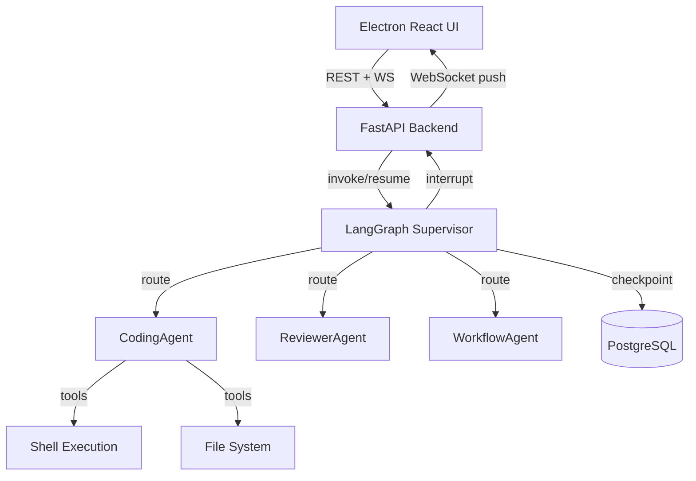

# Olympus — Implementation Plan (LangGraph Edition)

A production-ready desktop application for managing real AI agents with LangGraph-based orchestration, human-in-the-loop intervention, real shell execution, and real-time UI updates.

## Key Architecture Decision: LangGraph Replaces Celery + Custom Orchestrator

LangGraph provides a unified solution for what was previously split across Celery (queue) + custom orchestrator:

- **Supervisor pattern** — A supervisor agent routes tasks to specialized sub-agents (CodingAgent, ReviewerAgent, WorkflowAgent). No direct agent-to-agent calls.
- **`interrupt()`** — First-class HITL support. When an agent needs human input, it calls `interrupt()`, which checkpoints state and pauses execution.
- **`PostgresSaver`** — Persistent checkpointing to PostgreSQL. Tasks survive restarts and can pause indefinitely for human input.
- **`create_react_agent`** — Each sub-agent is a real LLM-powered ReAct agent with tool calling (shell execution, code generation, file I/O).
- **No Celery needed** — LangGraph handles async execution, state management, and retries natively.

---

## User Review Required

> [!IMPORTANT]
> **LLM API Key required**: Real agents need an LLM provider. The plan uses **OpenAI gpt-5-mini** via `langchain-openai`. You'll need an `OPENAI_API_KEY` env var. Can swap for Anthropic, Google, or local models easily.

> [!IMPORTANT]
> **Docker required**: PostgreSQL + Redis (for WebSocket pub/sub) via `docker-compose.yml`.

> [!WARNING]
> **Shell execution**: CodingAgent can execute real shell commands via subprocess. Commands are logged and sandboxed to a working directory.

---

## Proposed Changes

### Project Root

#### [NEW] [docker-compose.yml](file:///c:/Users/zappe/OneDrive/Documents/olympus/docker-compose.yml)
PostgreSQL (state/checkpoints) and Redis (WebSocket pub/sub).

#### [NEW] [.env.example](file:///c:/Users/zappe/OneDrive/Documents/olympus/.env.example)
Template for `OPENAI_API_KEY`, `DATABASE_URL`, `REDIS_URL`.

---

### Backend — FastAPI + LangGraph

#### [NEW] [requirements.txt](file:///c:/Users/zappe/OneDrive/Documents/olympus/backend/requirements.txt)
`fastapi`, `uvicorn`, `sqlalchemy`, `asyncpg`, `psycopg2-binary`, `langgraph`, `langchain`, `langchain-openai`, `pydantic`, `websockets`, `redis`

#### [NEW] [config.py](file:///c:/Users/zappe/OneDrive/Documents/olympus/backend/config.py)
Environment config via pydantic-settings.

#### [NEW] [models/database.py](file:///c:/Users/zappe/OneDrive/Documents/olympus/backend/models/database.py)
SQLAlchemy models: `Task`, `ActionLog`. Async engine + session factory.

#### [NEW] [models/schemas.py](file:///c:/Users/zappe/OneDrive/Documents/olympus/backend/models/schemas.py)
Pydantic schemas. Task states: `queued | running | waiting_for_human | completed | failed`.

#### [NEW] [agents/tools.py](file:///c:/Users/zappe/OneDrive/Documents/olympus/backend/agents/tools.py)
LangChain tools: `run_shell_command`, `read_file`, `write_file`, `list_directory`. These are real tool implementations.

#### [NEW] [agents/coding_agent.py](file:///c:/Users/zappe/OneDrive/Documents/olympus/backend/agents/coding_agent.py)
ReAct agent via `create_react_agent` with shell + file tools. System prompt for coding tasks.

#### [NEW] [agents/reviewer_agent.py](file:///c:/Users/zappe/OneDrive/Documents/olympus/backend/agents/reviewer_agent.py)
ReAct agent for code review. Can call `interrupt()` when confidence is low.

#### [NEW] [agents/workflow_agent.py](file:///c:/Users/zappe/OneDrive/Documents/olympus/backend/agents/workflow_agent.py)
ReAct agent that parses task descriptions into sub-task plans.

#### [NEW] [orchestrator/graph.py](file:///c:/Users/zappe/OneDrive/Documents/olympus/backend/orchestrator/graph.py)
**Core LangGraph graph**: Supervisor `StateGraph` with conditional routing to sub-agents. Uses `PostgresSaver` for checkpointing. Implements `interrupt()` for HITL. This replaces both the old orchestrator engine and Celery queue.

#### [NEW] [orchestrator/router.py](file:///c:/Users/zappe/OneDrive/Documents/olympus/backend/orchestrator/router.py)
FastAPI router: `POST /tasks`, `GET /tasks`, `POST /tasks/{id}/resume`, `GET /agents/status`.

#### [NEW] [orchestrator/websocket.py](file:///c:/Users/zappe/OneDrive/Documents/olympus/backend/orchestrator/websocket.py)
WebSocket manager at `/ws`. Pushes task state changes, agent logs, HITL events.

#### [NEW] [main.py](file:///c:/Users/zappe/OneDrive/Documents/olympus/backend/main.py)
FastAPI app entrypoint.

---

### Electron — Main Process

#### [NEW] [main/main.js](file:///c:/Users/zappe/OneDrive/Documents/olympus/main/main.js)
Electron main process. Creates BrowserWindow, loads renderer, registers IPC handlers.

#### [NEW] [main/preload.js](file:///c:/Users/zappe/OneDrive/Documents/olympus/main/preload.js)
Secure IPC bridge via `contextBridge`.

#### [NEW] [main/ipc-handlers.js](file:///c:/Users/zappe/OneDrive/Documents/olympus/main/ipc-handlers.js)
IPC implementations: shell execution, file I/O, native notifications.

---

### Electron — Renderer (React + Tailwind)

#### [NEW] [renderer/src/App.jsx](file:///c:/Users/zappe/OneDrive/Documents/olympus/renderer/src/App.jsx)
Root component with tab nav: Task Board, Agent Inspector, Intervention Panel.

#### [NEW] [renderer/src/components/TaskBoard.jsx](file:///c:/Users/zappe/OneDrive/Documents/olympus/renderer/src/components/TaskBoard.jsx)
Kanban board: Queued → Running → Blocked → Done.

#### [NEW] [renderer/src/components/AgentInspector.jsx](file:///c:/Users/zappe/OneDrive/Documents/olympus/renderer/src/components/AgentInspector.jsx)
Agent status, capabilities, and streaming logs.

#### [NEW] [renderer/src/components/InterventionPanel.jsx](file:///c:/Users/zappe/OneDrive/Documents/olympus/renderer/src/components/InterventionPanel.jsx)
HITL panel: shows blocked tasks, reason, and input form to resume.

#### [NEW] [renderer/src/components/CreateTaskModal.jsx](file:///c:/Users/zappe/OneDrive/Documents/olympus/renderer/src/components/CreateTaskModal.jsx)
Modal for creating new tasks.

#### [NEW] [renderer/src/hooks/useWebSocket.js](file:///c:/Users/zappe/OneDrive/Documents/olympus/renderer/src/hooks/useWebSocket.js)
WebSocket hook for real-time updates from backend.

#### [NEW] [renderer/src/api.js](file:///c:/Users/zappe/OneDrive/Documents/olympus/renderer/src/api.js)
REST API client for FastAPI backend.

---

### Shared Schemas

#### [NEW] [schemas/types.ts](file:///c:/Users/zappe/OneDrive/Documents/olympus/shared/schemas/types.ts)
TypeScript types mirroring Pydantic schemas.

---

## Verification Plan

### Startup Sequence
1. `docker-compose up -d` — PostgreSQL + Redis
2. `cd backend && uvicorn main:app --reload` — FastAPI + LangGraph
3. `npm start` — Electron

### End-to-End Test
1. Create task "Build API endpoint for CSV upload" from UI
2. WorkflowAgent parses → subtask plan
3. CodingAgent writes code (real LLM output + shell execution)
4. ReviewerAgent validates → triggers HITL if needed
5. Native notification appears in Electron
6. User responds in Intervention Panel → task resumes
7. All transitions visible in real-time on Task Board + Agent Inspector
